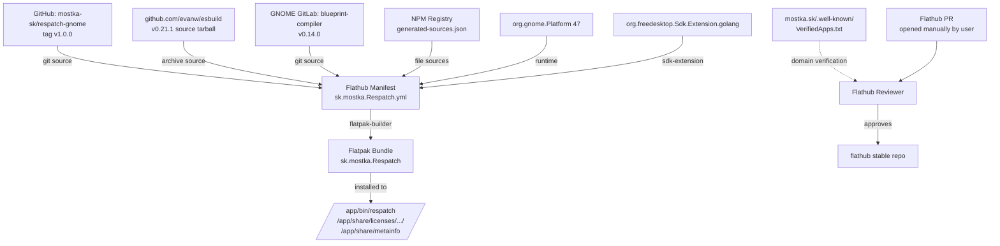

# Requirements

### Overview & Goals

Dopracovať aplikáciu `Respatch` do stavu, keď bude akceptovaná na Flathub stable repository **na prvý pokus** podľa oficiálnych pravidiel z [Flathub Requirements](https://docs.flathub.org/docs/for-app-authors/requirements). Vychádza sa z auditu `publish_requirements.md`, ktorý identifikoval 5 kritických blokerov a 4 upozornenia. Plán rieši všetky blokery oficiálnou cestou — bez žiadosti o výnimky.

### Scope

#### In scope
- **Premenovanie App ID** z `sk.tito10047.respatch` na `sk.mostka.Respatch` (overená doména `mostka.sk`).
- **Vydanie stabilnej verzie `1.0.0`** (bez `-beta` suffixu).
- **Upgrade GNOME runtime** z 46 na 47.
- **Build esbuild zo zdrojov v Go** (eliminuje precompiled binary porušenie).
- **Generovanie npm dependency manifestu** cez `flatpak-node-generator`.
- **Inštalácia LICENSE súborov** pre každý modul do `$FLATPAK_DEST/share/licenses/$FLATPAK_ID/`.
- **Pridanie host-dependent disclosure** do metainfo description.
- **Vytvorenie nového upstream repozitára** `github.com/mostka-sk/respatch-gnome` (manuálny krok používateľa). Názov `respatch-gnome` zvolený kvôli budúcim cross-platform klientom (`respatch-windows`, `respatch-macos`).
- **Doménová verifikácia** umiestnením tokenu na `https://mostka.sk/.well-known/org.flathub.VerifiedApps.txt` (manuálny krok používateľa).
- **Aktualizácia Flathub manifestu** v `/home/jozefm@no.dsidata.sk/phpProjects/contrib/respatch/flathub-respatch/`.
- **Otvorenie Flathub submission PR** manuálne používateľom (Flathub AI Policy zakazuje PR od AI agentov).

#### Out of scope
- Vývoj nových funkcií aplikácie.
- Refactoring existujúcej biznis logiky (ApiClient, Stores, Services).
- Zmena UI / Blueprint súborov nad rámec premenovania.
- Lokalizácia do ďalších jazykov (zostane EN + SK).

### User Stories

- Ako autor aplikácie chcem mať App ID, ktorého doménu naozaj vlastním, aby som prešiel Flathub doménovou verifikáciou.
- Ako Flathub reviewer chcem vidieť, že aplikácia je buildovaná zo zdrojov bez precompiled binárok, aby som ju mohol akceptovať bez výnimky.
- Ako Flathub reviewer chcem vidieť kompletné dependency manifesty pre všetky NPM balíky, aby build prešiel offline.
- Ako koncový užívateľ chcem nainštalovať aplikáciu z Flathub bez upozornení o chýbajúcich licenčných súboroch.
- Ako koncový užívateľ chcem v popise jasne vidieť, že aplikácia vyžaduje pripojenie k bežiacemu Symfony Messenger serveru.

### Functional Requirements

- App ID `sk.mostka.Respatch` je konzistentne použité v: manifeste, metainfo.xml, desktop súbore, GSettings schéme, GResource paths, ikonách, aplikačnom kóde a názvoch súborov.
- `flatpak-builder --user --install --force-clean build-dir sk.mostka.Respatch.yml` prejde **offline** (po stiahnutí sources) bez `--share=network`.
- `appstreamcli validate --pedantic --no-net` na novom metainfo.xml prejde bez warningov.
- `flathub-builder` build prejde úspešne pre **x86_64 aj aarch64** architektúry (lokálne overené pre x86_64).
- Po inštalácii sú v `$FLATPAK_DEST/share/licenses/sk.mostka.Respatch/` súbory: `respatch/LICENSE`, `blueprint-compiler/COPYING`, `esbuild/LICENSE.md`.
- Aplikácia spustená cez `flatpak run sk.mostka.Respatch` zobrazí hlavné okno bez chýb.

### Non-Functional Requirements

- Žiadne `--share=network` v `build-args`.
- Žiadne precompiled binárky stiahnuté z internetu (esbuild je buildovaný zo zdrojov v Go).
- Manifest aj metainfo musia prejsť oficiálnym Flathub buildbot validátorom (`flatpak-builder-lint`).
- Všetky reťazce v UI musia byť naďalej v angličtine s plnou SK lokalizáciou (`po/sk.po`).

# Technical Design

### Current Implementation

#### App ID
- **Aktuálny ID:** `sk.tito10047.respatch` — doména `tito10047.sk` nie je vo vlastníctve autora, čím Flathub doménová verifikácia zlyhá.
- ID je hardcoded v: `data/sk.tito10047.respatch.metainfo.xml`, `data/sk.tito10047.respatch.desktop`, `data/sk.tito10047.respatch.Daemon.desktop`, `data/sk.tito10047.respatch.gschema.xml`, `data/respatch.gresource.xml`, `data/icons/hicolor/*/apps/sk.tito10047.respatch.png`, `data/icons/hicolor/scalable/apps/sk.tito10047.respatch.svg`, `meson.build`, `data/meson.build`, manifest `sk.tito10047.respatch.yml`, Flathub manifest `flathub-respatch/sk.tito10047.respatch/sk.tito10047.respatch.yml`, a v `src/` (Application.ts pre `Adw.Application` `application_id`, GSettings schema path).

#### esbuild
- Aktuálne stiahnutý ako precompiled binary z `https://registry.npmjs.org/@esbuild/linux-x64/-/linux-x64-0.21.1.tgz` — porušuje pravidlo "Building from source".
- Volaný cez `find_program('esbuild')` v `meson.build` → potrebuje `/app/bin/esbuild` počas buildu aj `dist/main.mjs` po inštalácii (esbuild beží len pri builde, nie runtime).

#### NPM závislosti
- `package.json` obsahuje devDependencies (TypeScript, esbuild, vitest, msw, GIR types).
- `meson.build` volá `npm ci` v `node_modules/.bin/` cestu? Nie — momentálne sa esbuild volá z `/app/bin/esbuild` (priamo nainštalovaný).
- TS sa kompiluje cez `esbuild src/main.ts --bundle ...` (pozri `package.json`).
- Ostatné devDependencies (TypeScript, GIR types) **nie sú** runtime, ale potrebné pre build.
- Aktuálne nie je riešené offline npm install počas Flathub buildu.

#### License súbory
- `package.json` deklaruje `"license": "ISC"`, ale `metainfo.xml` deklaruje `MIT`.
- V repo nie je `LICENSE` súbor na top-level.
- V manifeste nie je inštalácia licencií žiadneho modulu.

#### Repository
- Aktuálne odkazuje na `https://github.com/respatch/respatch-gnome.git` (existencia nepotvrdená); nový kanonický upstream bude `https://github.com/mostka-sk/respatch-gnome.git`.
- Lokálny repo `app/` má pushed tagy `v0.1.0-beta`.
- Používateľ povolil agentovi prístup k celému monorepu `/home/jozefm@no.dsidata.sk/phpProjects/contrib/respatch` — všetky zmeny, commity a tagy v `app/` aj `flathub-respatch/` urobí agent.

### Key Decisions

 # | Rozhodnutie | Voľba | Dôvod |
---|-------------|--------|-------|
 1 | **Nový App ID** | `sk.mostka.Respatch` | Doména `mostka.sk` overiteľná HTTPS, PSL match cez `sk` TLD; PascalCase posledný komponent podľa GNOME konvencie. |
 2 | **esbuild stratégia** | Build zo zdrojov v Go cez `org.freedesktop.Sdk.Extension.golang` | Plný súlad s Flathub "build from source" pravidlom; podporuje x86_64 aj aarch64. |
 3 | **GitHub repo** | `github.com/mostka-sk/respatch-gnome` | Nová organizácia `mostka-sk` (`mostka` obsadené); repo má suffix `-gnome` pretože sú plánované aj `respatch-windows` a `respatch-macos` klienty — App ID zostáva `sk.mostka.Respatch` podľa GNOME konvencie. |
 4 | **Stabilná verzia** | `1.0.0` | Klasická prvá stabilná verzia podľa SemVer; Flathub stable repo neakceptuje beta. |
 5 | **GNOME runtime** | `47` | Najnovšia stabilná verzia v čase submission, povinné podľa Flathub Required Files. |
 6 | **Architektúry** | x86_64 + aarch64 | Build esbuildu zo zdrojov funguje na obe; nepotrebujeme `flathub.json` (default). |
 7 | **NPM tooling** | `flatpak-node-generator` | Oficiálny tool z `flatpak/flatpak-builder-tools`; vygeneruje `generated-sources.json` z `package-lock.json` so všetkými URL + sha256. |
 8 | **License súbory** | Per-modul cez `post-install` | Postup priamo z requirements (sekcia "Installing license files"); blueprint-compiler je LGPL-3.0-or-later, esbuild je MIT, respatch je MIT. |

### Proposed Changes

#### 1. Premenovanie App ID
- Hromadná zmena `sk.tito10047.respatch` → `sk.mostka.Respatch` v ~15 súboroch.
- GSettings schema path zmeniť z `/sk/tito10047/respatch/` na `/sk/mostka/Respatch/` (alebo `/sk/mostka/respatch/` — zachovať lowercase pre path, pretože GSettings paths sú konvenčne lowercase; ID ostane PascalCase).
- `Adw.Application` `application_id` v `src/Application.ts` aktualizovať.
- Premenovať fyzické súbory: `data/sk.tito10047.respatch.metainfo.xml` → `data/sk.mostka.Respatch.metainfo.xml`, podobne `desktop`, `Daemon.desktop`, `gschema.xml` a všetky ikony.
- Manifest premenovať: `sk.tito10047.respatch.yml` → `sk.mostka.Respatch.yml`.
- Flathub priečinok: `flathub-respatch/sk.tito10047.respatch/` → `flathub-respatch/sk.mostka.Respatch/`.

#### 2. Stabilná verzia 1.0.0
- `package.json` `version`: `1.0.0` (už je `1.0.0`, len bez beta tagov).
- `metainfo.xml` `<release version="1.0.0" date="YYYY-MM-DD">` s release notes.
- `metainfo.xml` URL screenshotu/videa zmeniť branch z `main` na `1.0.0` alebo nechať `main` (na rozhodnutí).
- Vytvoriť git tag `v1.0.0` na novom upstream repe.

#### 3. GNOME runtime 47
- V manifeste `runtime-version: '47'`.
- Otestovať build a beh — libadwaita 1.6 (GNOME 47) môže mať drobné API zmeny; ak sa vyskytnú warningy/errors, opraviť kód.

#### 4. esbuild build from Go source
- V manifeste pridať:
  ```yaml
  sdk-extensions:
    - org.freedesktop.Sdk.Extension.golang
  ```
- Modul `esbuild` prepísať:
  ```yaml
  - name: esbuild
    buildsystem: simple
    build-options:
      append-path: /usr/lib/sdk/golang/bin
      env:
        GOROOT: /usr/lib/sdk/golang
        GOFLAGS: -trimpath
    sources:
      - type: archive
        url: https://github.com/evanw/esbuild/archive/refs/tags/v0.21.1.tar.gz
        sha256: <z github release>
    build-commands:
      - go build -mod=vendor -o esbuild ./cmd/esbuild   # alebo bez -mod=vendor podľa esbuild repo
      - install -Dm0755 esbuild /app/bin/esbuild
      - install -Dm0644 LICENSE.md $FLATPAK_DEST/share/licenses/sk.mostka.Respatch/esbuild/LICENSE.md
  ```
- esbuild repo má vendored deps → nie je potrebné riešiť Go modules offline. Overiť cez `ls vendor/` v archíve.

#### 5. NPM dependency manifest
- Spustiť mimo Flathub buildu:
  ```bash
  pip install --user flatpak-node-generator   # alebo cez git clone
  flatpak-node-generator npm package-lock.json -o generated-sources.json
  ```
- Output `generated-sources.json` obsahuje desiatky URL + sha256 pre všetky balíky.
- V manifeste pridať pre `respatch` modul:
  ```yaml
  - name: respatch
    buildsystem: meson
    build-options:
      env:
        npm_config_offline: 'true'
        npm_config_cache: /run/build/respatch/npm-cache
    sources:
      - type: dir
        path: .
      - generated-sources.json    # injekcia npm sources
    build-commands-pre:
      - npm ci --offline
  ```
- Alebo zariadiť cez `meson.build` (existujúci `npm ci` step).
- `generated-sources.json` commitnúť do app repa.

#### 6. License files
- Pridať `LICENSE` (MIT) na top-level app repa.
- V `data/meson.build` pridať:
  ```meson
  install_data('../LICENSE',
    install_dir: get_option('datadir') / 'licenses' / meson.project_name() / 'respatch'
  )
  ```
- V manifeste pre `blueprint-compiler` modul pridať `post-install`:
  ```yaml
  post-install:
    - install -Dm0644 COPYING $FLATPAK_DEST/share/licenses/sk.mostka.Respatch/blueprint-compiler/COPYING
  ```
- Pre `esbuild` modul (pozri stage 4) — license už zahrnutý.

#### 7. Host-dependent disclosure v metainfo
- Pridať na začiatok `<description>`:
  ```xml
  <description>
    <p>Note: Respatch is a client application that requires a running Symfony Messenger server with the Respatch monitoring endpoint enabled. See https://github.com/mostka-sk/respatch-gnome for setup instructions.</p>
    ...
  </description>
  ```

#### 8. Repository setup
- Používateľ vytvorí GitHub org `mostka-sk` → potvrdí.
- Používateľ vytvorí repo `mostka-sk/respatch-gnome` (verejný) → potvrdí.
- Agent má povolený prístup k celému monorepu `/home/jozefm@no.dsidata.sk/phpProjects/contrib/respatch` — môže robiť zmeny, commity a tagy v `app/` aj v `flathub-respatch/`.
- Agent nastaví remote, pushne kompletný app repo (po všetkých zmenách).
- Agent vytvorí git tag `v1.0.0` a pushne (s commit hashom zapísaným do Flathub manifestu).
- Používateľ umiestni token na `https://mostka.sk/.well-known/org.flathub.VerifiedApps.txt` (token získa po otvorení PR od Flathub bota alebo manuálne podľa [Verification docs](https://docs.flathub.org/docs/for-app-authors/verification)).

#### 9. Flathub manifest update
- Premenovať priečinok `flathub-respatch/sk.tito10047.respatch/` na `flathub-respatch/sk.mostka.Respatch/`.
- Manifest premenovať na `sk.mostka.Respatch.yml`.
- Aktualizovať obsah: app-id, runtime 47, esbuild Go build, blueprint-compiler tag/commit, respatch source URL na `https://github.com/mostka-sk/respatch-gnome.git`, tag `v1.0.0` + commit hash, generated-sources.json.
- Commit + push na Flathub repo.

#### 10. Flathub PR (manuálne, používateľ)
- Používateľ otvorí PR na `https://github.com/flathub/flathub` proti base branch `new-pr` (Flathub AI Policy zakazuje AI-generated PR).
- Použije `pr_message.md` (aktualizovaný novým App ID a screenshotmi).

### File Structure

```
app/
├── LICENSE                                   # NOVÝ (MIT)
├── flathub.json                              # NEPRIDÁVAME — default oba arches
├── generated-sources.json                    # NOVÝ (flatpak-node-generator output)
├── sk.mostka.Respatch.yml                    # PREMENOVANÉ + PREPÍSANÉ
├── meson.build                               # update project name + license install
├── package.json                              # license: MIT (zhodné s metainfo)
├── data/
│   ├── sk.mostka.Respatch.metainfo.xml       # PREMENOVANÉ + nový ID + 1.0.0 release + host-dep note
│   ├── sk.mostka.Respatch.desktop            # PREMENOVANÉ + Icon=sk.mostka.Respatch
│   ├── sk.mostka.Respatch.Daemon.desktop     # PREMENOVANÉ
│   ├── sk.mostka.Respatch.gschema.xml        # PREMENOVANÉ + path /sk/mostka/Respatch/
│   ├── icons/hicolor/*/apps/sk.mostka.Respatch.{svg,png}  # PREMENOVANÉ
│   ├── meson.build                           # update všetkých referencií + license install
│   └── respatch.gresource.xml                # update prefix path
└── src/
    ├── Application.ts                        # application_id: 'sk.mostka.Respatch'
    └── services/SettingsService.ts           # GSettings schema id update

flathub-respatch/
└── sk.mostka.Respatch/                       # PREMENOVANÉ
    └── sk.mostka.Respatch.yml                # úplne prepísaný
```

### Architecture Diagram



### Risks

 Risk | Mitigation |
------|------------|
 **esbuild Go build zlyhá** (vendored deps neúplné, Go SDK extension chýba) | Pred push otestovať lokálne `flatpak-builder` build. Ak vendored neexistuje, doplniť Go modules ako separátne sources cez `flatpak-go-deps-tool`. |
 **GNOME 47 breaking changes** v libadwaita | Spustiť `npm run start` pred submission a debug všetky deprecation warningy; ak sú kritické, ponechať runtime 46 a uviesť dôvod v PR. |
 **GitHub org `mostka-sk` obsadený** | Používateľ potvrdil že použije org `mostka-sk` a repo `respatch-gnome`. |
 **Doménová verifikácia zlyhá** | Token musí byť presne na `https://mostka.sk/.well-known/org.flathub.VerifiedApps.txt` ako plain text bez BOM; over cez `curl -s https://mostka.sk/.well-known/org.flathub.VerifiedApps.txt`. |
 **flatpak-node-generator output zastaralý** pri update package-lock.json | Zaradiť do dev workflow `npm install + regenerate generated-sources.json` ako commit-required krok. |
 **AI policy violation** — moja účasť na PR | Používateľ otvorí PR manuálne, prečíta a schváli každý commit; PR description napíše vlastnými slovami (nie copy-paste z `pr_message.md` bez review). |
 **Schema path zmena** rozbije existujúce nastavenia užívateľov | Aplikácia zatiaľ nie je publikovaná, žiadni existujúci užívatelia nie sú; bezpečné. |

# Manual Steps

### Kroky, ktoré musí spraviť používateľ (nie agent)

Nasledovné kroky **nemôže spraviť AI agent** — buď ide o akciu mimo lokálnej pracovnej kópie, alebo o akciu zakázanú Flathub AI policy. Po každom potvrdení používateľa agent pokračuje v ďalších stages.

#### 1. Vytvorenie GitHub organizácie a repozitára
- [ ] Otvoriť `https://github.com/account/organizations/new` a vytvoriť organizáciu **`mostka-sk`** (Free plan stačí).
- [ ] Vytvoriť verejný repo **`respatch-gnome`** v tejto organizácii (názov s `-gnome` suffixom kvôli budúcim cross-platform klientom).
- [ ] Potvrdiť agentovi: *"Repo `github.com/mostka-sk/respatch-gnome` je vytvorený a verejný."*

#### 2. Push aplikačného kódu a vytvorenie tagu v1.0.0
- Push commitov a vytvorenie tagu `v1.0.0` urobí **agent** (používateľ povolil prístup k celému monorepu `/home/jozefm@no.dsidata.sk/phpProjects/contrib/respatch`).
- Používateľ len finálne overí commity a tag pred otvorením Flathub PR.

#### 3. Doménová verifikácia mostka.sk
- [ ] Po podaní PR Flathub bot poskytne verifikačný token.
- [ ] Umiestniť token na **`https://mostka.sk/.well-known/org.flathub.VerifiedApps.txt`** (plain text, bez BOM).
- [ ] Overiť cez:
  ```bash
  curl -sI https://mostka.sk/.well-known/org.flathub.VerifiedApps.txt
  curl -s  https://mostka.sk/.well-known/org.flathub.VerifiedApps.txt
  ```
- [ ] HTTP status musí byť `200 OK`, obsah musí presne zodpovedať tokenu od Flathub.

#### 4. Otvorenie Flathub PR (manuálne, NIE cez AI)
- [ ] Fork `https://github.com/flathub/flathub` na svoj GitHub účet.
- [ ] Skopírovať priečinok `flathub-respatch/sk.mostka.Respatch/` do forku (agent ho pripraví v monorepu).
- [ ] Vytvoriť branch (napr. `add-sk.mostka.Respatch`).
- [ ] Otvoriť PR proti **base branch `new-pr`** (NIE `master`).
- [ ] PR description napísať **vlastnými slovami** (referenčný `pr_message.md` len ako šablóna).
- [ ] Disable Copilot review podľa AI policy: `https://github.com/settings/copilot/coding_agent`.
- [ ] Reagovať na review pripomienky manuálne (bez kopírovania AI výstupov).

# Delivery Steps

### ✓ Step 1: Premenovanie App ID na sk.mostka.Respatch
Aplikácia, manifest a všetky dátové súbory používajú nový App ID `sk.mostka.Respatch` konzistentne; lokálny build cez `flatpak-builder` prejde a aplikácia sa spustí pod novým ID.

- Premenovať fyzické súbory v `data/`: `sk.tito10047.respatch.metainfo.xml`, `sk.tito10047.respatch.desktop`, `sk.tito10047.respatch.Daemon.desktop`, `sk.tito10047.respatch.gschema.xml` a všetky ikony v `data/icons/hicolor/*/apps/` na nové názvy `sk.mostka.Respatch.*`.
- Aktualizovať obsah `metainfo.xml`: `<id>sk.mostka.Respatch</id>`, homepage/bugtracker URL na `https://github.com/mostka-sk/respatch-gnome`, screenshot/video URL na `mostka-sk/respatch-gnome/main`.
- Aktualizovať `desktop` súbor: `Icon=sk.mostka.Respatch`.
- Aktualizovať GSettings `gschema.xml`: `id="sk.mostka.Respatch"`, `path="/sk/mostka/Respatch/"`.
- Aktualizovať `data/respatch.gresource.xml` prefix na `/sk/mostka/Respatch`.
- Aktualizovať `data/meson.build` — všetky `install_data` referencie na nové názvy.
- Aktualizovať `meson.build` (root) — `project('respatch', ...)` ostáva, ale konštanty pre App ID upraviť.
- Aktualizovať `src/Application.ts` — `application_id: 'sk.mostka.Respatch'`.
- Aktualizovať `src/services/SettingsService.ts` — schema id na `sk.mostka.Respatch`.
- Premenovať Flatpak manifest: `sk.tito10047.respatch.yml` → `sk.mostka.Respatch.yml`, vnútri aktualizovať `app-id`.
- Premenovať priečinok Flathub: `flathub-respatch/sk.tito10047.respatch/` → `flathub-respatch/sk.mostka.Respatch/`.
- Aktualizovať `pr_message.md` na nový App ID a URL repa.
- Lokálne overenie: `flatpak-builder --user --install --force-clean build-dir sk.mostka.Respatch.yml` + `flatpak run sk.mostka.Respatch`.

### * Step 2: Stabilná verzia 1.0.0, GNOME runtime 47, host-dependent disclosure
Aplikácia je release-ready: verzia `1.0.0`, runtime 47, metainfo deklaruje host-dependent charakter; lokálny build prejde, `appstreamcli validate --pedantic --no-net` prejde bez warningov.

- V `data/sk.mostka.Respatch.metainfo.xml` aktualizovať `<release>` na `version="1.0.0"` s aktuálnym dátumom a release notes (`<description><p>First stable release.</p></description>`).
- Odstrániť všetky zmienky `beta` z metainfo.
- V manifeste `sk.mostka.Respatch.yml` zmeniť `runtime-version: '47'` (z `46`).
- V `package.json` overiť `"version": "1.0.0"` (už je) a nastaviť `"license": "MIT"` (zhoda s metainfo).
- Pridať na začiatok `<description>` v metainfo nový `<p>` s host-dependent notou: aplikácia vyžaduje bežiaci Symfony Messenger server s Respatch monitoring endpointom; odkaz na setup inštrukcie v repe.
- Spustiť lokálne `appstreamcli validate --pedantic --no-net data/sk.mostka.Respatch.metainfo.xml` — musí prejsť bez chýb.
- Lokálne overenie buildu na novom runtime 47: `flatpak-builder --user --install --force-clean build-dir sk.mostka.Respatch.yml` + `flatpak run sk.mostka.Respatch`; ak sa objavia GTK/libadwaita deprecation warningy, opraviť kód.

###   Step 3: Build esbuild zo zdrojov v Go
Manifest neobsahuje žiadny precompiled binary; esbuild sa buildí lokálne v sandboxe z oficiálneho upstream zdrojového archívu pomocou Go SDK extension.

- V manifeste `sk.mostka.Respatch.yml` pridať `sdk-extensions: [org.freedesktop.Sdk.Extension.golang]`.
- Prepísať modul `esbuild`:
  - Source: `type: archive`, URL `https://github.com/evanw/esbuild/archive/refs/tags/v0.21.1.tar.gz`, vypočítaný sha256.
  - `build-options`: `append-path: /usr/lib/sdk/golang/bin`, `env: { GOROOT: /usr/lib/sdk/golang, GOFLAGS: '-trimpath -mod=vendor' }`.
  - `build-commands`: `go build -o esbuild ./cmd/esbuild` + `install -Dm0755 esbuild /app/bin/esbuild` + `install -Dm0644 LICENSE.md $FLATPAK_DEST/share/licenses/sk.mostka.Respatch/esbuild/LICENSE.md`.
- Overiť, že esbuild repo v0.21.1 obsahuje `vendor/` priečinok (vendored Go deps); ak nie, doplniť Go modules ako separátne `file` sources cez `flatpak-go-deps`.
- To isté skopírovať aj do Flathub manifestu v `flathub-respatch/sk.mostka.Respatch/sk.mostka.Respatch.yml`.
- Lokálne overenie: čistý build cez `flatpak-builder` musí postaviť esbuild a aplikáciu úspešne; spustenie aplikácie potvrdí funkčnosť.

###   Step 4: Generovanie a integrácia npm dependency manifestu
Všetky NPM závislosti sú deklarované v `generated-sources.json` ako file sources s URL + sha256; offline `npm ci` počas Flatpak buildu prejde bez sieťového prístupu.

- Nainštalovať tooling: `pip install --user flatpak-node-generator` (alebo cez git clone z `flatpak/flatpak-builder-tools`).
- Spustiť `flatpak-node-generator npm package-lock.json -o generated-sources.json` v root app priečinka.
- Commitnúť `generated-sources.json` do repa (+ pridať do `.gitignore` ak existuje stará cache).
- V manifeste `sk.mostka.Respatch.yml` pre modul `respatch`:
  - Pridať `generated-sources.json` ako include do `sources`.
  - Pridať `build-options.env`: `npm_config_offline=true`, `npm_config_cache=/run/build/respatch/flatpak-node/npm-cache`.
  - Pridať `build-commands` pred meson configure: `npm ci --offline`.
- Aktualizovať `meson.build` ak je tam volanie `npm ci` — používať `--offline` flag.
- Skopírovať tie isté zmeny do Flathub manifestu.
- Lokálne overenie offline buildu: `flatpak-builder --disable-rofiles-fuse --user --install --force-clean build-dir sk.mostka.Respatch.yml` musí prejsť (na novom čistom systéme bez npm cache).

###   Step 5: Inštalácia LICENSE súborov pre všetky moduly
Po inštalácii sú v `$FLATPAK_DEST/share/licenses/sk.mostka.Respatch/` license súbory pre `respatch`, `blueprint-compiler` a `esbuild` v predpísanej štruktúre podľa Flathub Requirements.

- Vytvoriť `LICENSE` (MIT, plný text) na top-level app repa s Copyright Jozef Marcin (alebo skutočné meno autora).
- V `data/meson.build` pridať `install_data('../LICENSE', install_dir: get_option('datadir') / 'licenses' / 'sk.mostka.Respatch' / 'respatch')`.
- V manifeste pre modul `blueprint-compiler` pridať `post-install: - install -Dm0644 COPYING $FLATPAK_DEST/share/licenses/sk.mostka.Respatch/blueprint-compiler/COPYING`.
- Pre modul `esbuild` (Stage 3) — license install už zahrnutý v `build-commands`.
- Synchronizovať to isté do Flathub manifestu.
- Lokálne overenie: po `flatpak-builder ... --install` skontrolovať obsah `~/.local/share/flatpak/app/sk.mostka.Respatch/current/active/files/share/licenses/sk.mostka.Respatch/` — musí obsahovať tri podpriečinky.

###   Step 6: Repository setup, Flathub manifest update a publish workflow
Upstream repo `github.com/mostka-sk/respatch-gnome` obsahuje finálny kód s tagom `v1.0.0`; Flathub priečinok je pripravený na manuálne otvorenie PR používateľom.

- **Manuálny krok používateľa:** vytvoriť GitHub org `mostka-sk` a repo `respatch-gnome` (verejný), potvrdiť agentovi.
- Agent nastaví git remote v lokálnom app repe: `git remote add upstream git@github.com:mostka-sk/respatch-gnome.git`.
- Agent pushne všetky commity na nový remote: `git push upstream main`.
- Agent vytvorí a pushne git tag: `git tag -a v1.0.0 -m "Release 1.0.0" && git push upstream v1.0.0`; commit hash zapíše do Flathub manifestu.
- Aktualizovať Flathub manifest `flathub-respatch/sk.mostka.Respatch/sk.mostka.Respatch.yml`:
  - `app-id: sk.mostka.Respatch`, `runtime-version: '47'`, `command: respatch`.
  - Modul `respatch`: `type: git`, `url: https://github.com/mostka-sk/respatch-gnome.git`, `tag: v1.0.0`, `commit: <hash>`.
  - Skopírovať esbuild Go-build modul, license post-installs, generated-sources.json reference.
- Commit + push na Flathub fork repo.
- Aktualizovať `pr_message.md` s novým App ID, video URL, opisom aplikácie a host-dependent diskurzom.
- **Manuálny krok používateľa (AI policy):** otvoriť PR na `flathub/flathub` proti base branch `new-pr`, PR description napísať vlastnými slovami, disable Copilot review.
- **Manuálny krok používateľa:** po obdržaní verifikačného tokenu od Flathub bota umiestniť ho na `https://mostka.sk/.well-known/org.flathub.VerifiedApps.txt` a overiť cez `curl`.