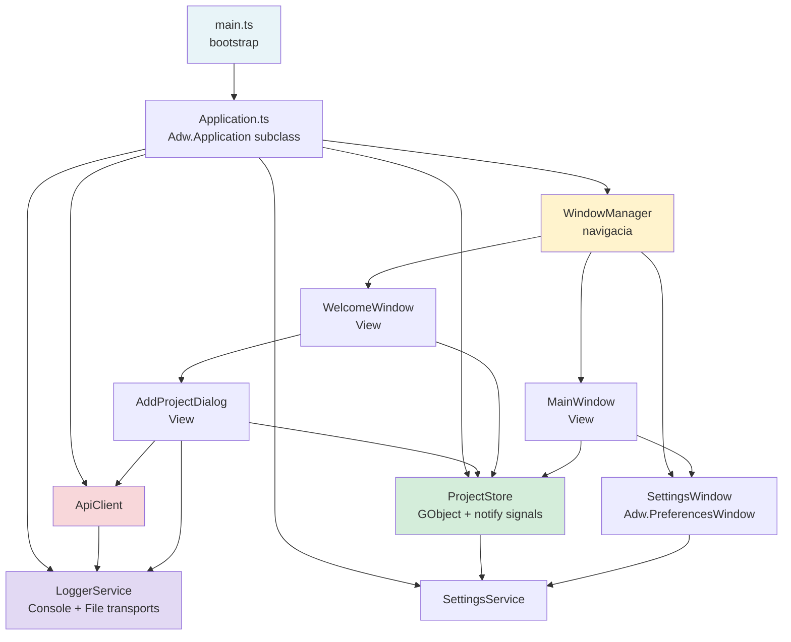

# Requirements

### Overview & Goals

Aktuálny `main.ts` (150 riadkov) obsahuje všetku logiku aplikácie na jednom mieste — inicializáciu aplikácie, správu okien, API volania, stav dialógu aj navigáciu. Cieľom je tento spaghetti kód rozdeliť do čistej **MVVM architektúry** vhodnej pre rastúcu aplikáciu s viacerými oknami. Súčasťou refaktoringu je aj pokročilý systém logovania a okno Nastavení.

### Scope

**In Scope:**
- Rozdelenie `main.ts` do vrstiev: Application bootstrap, Windows (View), Stores (ViewModel), Services (Model)
- Zavedenie `WindowManager` — centrálneho správcu okien a prechodov medzi nimi
- Refaktor `WelcomeWindow` + `AddProjectDialog` do samostatných tried
- Refaktor `MainWindow` do samostatnej triedy
- Migrácia API volania z `main.ts` do `ApiClient` service
- Zachovanie existujúcej funkcionality (žiadne regresie)
- Implementácia `LoggerService` s podporou konzoly (vývoj) a súborového logu (produkcia)
- Nastavenie logovania (zapnúť/vypnúť, cieľ výstupu) cez okno Nastavení
- Nové okno Nastavení (`SettingsWindow`) dostupné z `MainWindow`

**Out of Scope:**
- Implementácia novej funkcionality (dashboard, fronty, workery)
- Zmeny v `.blp` UI súboroch pre existujúce obrazovky (okrem pridania gear tlačidla do `main.blp`)
- Zmena build systému

### User Stories

- Ako vývojár chcem každé okno v samostatnom súbore, aby som pri práci na jednom okne neovplyvnil ostatné
- Ako vývojár chcem centrálne miesto pre navigáciu medzi oknami, aby som nemusel hľadať `showMainWindow()` volania po celom kóde
- Ako vývojár chcem aby služby (API, settings) nevedeli nič o GTK widgetoch, aby som ich mohol testovať vo Viteste
- Ako vývojár chcem pridať nové okno vytvorením jednej triedy bez toho, aby som menil `main.ts`
- Ako vývojár chcem vidieť debug logy priamo v konzole PhpStorm počas vývoja, bez nutnosti otvárať externé súbory
- Ako vývojár chcem, aby v produkčnej verzii aplikácie boli logy zapisované do súboru (`~/.local/share/respatch/respatch.log`)
- Ako používateľ chcem mať možnosť logovanie zapnúť alebo vypnúť v nastaveniach aplikácie, aby zbytočne nezahlcovalo disk
- Ako používateľ chcem pristupovať k nastaveniam z hlavného okna jedným kliknutím

# Technical Design

### Current Implementation

`src/main.ts` robí všetko naraz:
- Vytvára `Adw.Application` a registruje `activate` handler
- Obsahuje inline funkcie `showWelcomeWindow()` a `showMainWindow()`
- Priamo buduje `Gtk.Builder`, získava widgety a zapojuje signály
- Obsahuje celú business logiku dialogu (state machine `verify -> add -> error`) vrátane `fetch` volania
- Rozhoduje, ktoré okno zobraziť pri štarte

### Key Decisions

 Rozhodnutie | Voľba | Dôvod |
---|---|---|
 Vzor pre okná | Trieda `*Window` s injektovanými závislosťami | Každé okno je OOP objekt, nie sada voľných funkcií |
 Navigácia | `WindowManager` s metódami `showWelcome()` / `showMain()` | Jedno miesto pre všetky prechody; okná sa navzájom nepoznajú |
 Stav aplikácie | `ProjectStore` (GObject s `notify::` signálmi) | UI sa prihlási na zmeny |
 API vrstva | `ApiClient` service — čisté TS, bez GTK | Testovateľné cez Vitest + MSW |
 Bootstrapping | `Application.ts` subclass `Adw.Application` | `main.ts` sa redukuje na 10 riadkov |
 Logovanie — transport | `LoggerService` s pluggable `LogTransport[]` (Console + File) | Ľahko rozšíriteľné, testovateľné bez GTK |
 Logovanie — detekcia prostredia | Explicitný parameter `devMode` v `Application.ts` (napr. `GLib.getenv('G_MESSAGES_DEBUG')`) | Bez nutnosti meniť GSettings pri vývoji |
 Logovanie — konfigurácia | GSettings kľúče `logging-enabled` (bool) a `log-to-file` (bool) | Perzistentné nastavenie, riadené cez `SettingsWindow` |
 Okno nastavení | `SettingsWindow` ako `Adw.PreferencesWindow` | Štandardný GNOME vzor; ľahko rozšíriteľné o ďalšie sekcie |

### Proposed File Structure

```
src/
  main.ts                          bootstrap only (~10 riadkov)
  Application.ts                   NEW: Adw.Application subclass
  WindowManager.ts                 NEW: navigacia medzi oknami
  gettext.ts                       nezmenene
  libs/fetch.ts                    nezmenene
  models/Project.ts                nezmenene
  services/
    SettingsService.ts             nezmenene
    ApiClient.ts                   NEW: HTTP logika bez GTK
    LoggerService.ts               NEW: transport-based logger (Console + File)
  stores/
    ProjectStore.ts                NEW: GObject, notify signaly
  ui/
    windows/
      WelcomeWindow.ts             NEW
      MainWindow.ts                NEW
      SettingsWindow.ts            NEW
    dialogs/
      AddProjectDialog.ts          NEW
    window.blp                     nezmenene
    main.blp                       UPDATED: + gear icon button v header bare
    add_project_dialog.blp         nezmenene
    settings.blp                   NEW: Adw.PreferencesWindow s logging togglemi
tests/
  ApiClient.test.ts                NEW
  ProjectStore.test.ts             NEW
  LoggerService.test.ts            NEW
  mocks/handlers.ts                NEW
  dummy.test.ts                    nezmenene
data/
  org.respatch.gschema.xml         UPDATED: + logging-enabled, log-to-file keys
```

### Architecture Diagram



### Key Class Interfaces

```typescript
// LoggerService.ts — bez GTK, testovatelne
interface LogTransport {
  write(level: LogLevel, message: string, context?: object): void
}
type LogLevel = 'debug' | 'info' | 'warn' | 'error';

class LoggerService {
  constructor(private transports: LogTransport[],
              private enabled: boolean = true) {}
  debug(message: string, context?: object): void
  info(message: string, context?: object): void
  warn(message: string, context?: object): void
  error(message: string, context?: object): void
  setEnabled(enabled: boolean): void
}

// ConsoleTransport — viditelne v PhpStorm Run konzole
class ConsoleTransport implements LogTransport {
  write(level: LogLevel, message: string, context?: object): void
  // format: [INFO] 2025-01-01T12:00:00Z Sprava {context}
}

// FileTransport — zapisuje do ~/.local/share/respatch/respatch.log cez Gio.File
class FileTransport implements LogTransport {
  constructor(private logPath: string) {}
  write(level: LogLevel, message: string, context?: object): void
}

// ApiClient.ts — bez GTK, testovatelne
class ApiClient {
  constructor(private logger: LoggerService) {}
  async verifyProject(url: string, token: string): Promise<void>
}

// ProjectStore.ts — GObject s notify signalmi
class ProjectStore extends GObject.Object {
  getActiveProject(): Project | null
  setActiveProject(id: string): void
  getProjects(): Project[]
  addProject(project: Project): void
  hasActiveProject(): boolean
}

// WindowManager.ts
class WindowManager {
  constructor(app: Adw.Application, uiDir: string,
              store: ProjectStore, apiClient: ApiClient,
              settingsService: SettingsService, logger: LoggerService) {}
  showWelcome(): void
  showMain(): void
  showSettings(parent: Gtk.Window): void
}

// SettingsWindow.ts
class SettingsWindow {
  constructor(app: Adw.Application, uiDir: string,
              settingsService: SettingsService,
              logger: LoggerService) {}
  present(): void
}

// AddProjectDialog.ts
class AddProjectDialog {
  constructor(parent: Gtk.Window, uiDir: string,
              apiClient: ApiClient, store: ProjectStore,
              logger: LoggerService, onSuccess: () => void) {}
  present(): void
}
```

### Risks

- **GObject dedičnosť pre Store:** `ProjectStore extends GObject.Object` vyžaduje správnu registráciu `GObject.registerClass` — treba overiť syntax v GJS/TypeScript
- **Cyklické závislosti:** `WelcomeWindow` -> `WindowManager` -> `WelcomeWindow` — riešenie: `WindowManager` vytvára okná lazy, nie v konštruktore
- **`libs/fetch.ts`** používa starý Soup 2 API — nie je blokátorom refaktoringu, ale môže sa migrovať na natívny `fetch()` v rámci `ApiClient`
- **GSettings schéma** — nové kľúče `logging-enabled` a `log-to-file` treba pridať do `data/org.respatch.gschema.xml` a znovu spustiť `build:schemas`
- **Rotácia log súboru** — v prvej verzii sa log len pripisuje (append); `FileTransport` treba navrhnúť s týmto na pamäti pre budúce rozšírenie

# Testing

### Validation Approach

Po každom kroku sa spustí `npm run build` a overí sa, že aplikácia štartuje bez chýb. Unit testy pre `ApiClient`, `ProjectStore` a `LoggerService` sa pridajú do `tests/`.

### Key Scenarios

 Scenár | Očakávaný výsledok |
---|---|
 Spustenie bez aktívneho projektu | Zobrazí sa `WelcomeWindow` |
 Spustenie s aktívnym projektom | Zobrazí sa `MainWindow` priamo |
 Klik na Pridať projekt | Otvorí sa `AddProjectDialog` modálne |
 Overenie neplatného tokenu | Dialog zobrazí toast s chybou, tlačidlo = Skúsiť znova |
 Overenie platného tokenu | Tlačidlo sa zmení na Uložiť (success stav) |
 Uloženie projektu | `WelcomeWindow` sa zatvorí, otvorí sa `MainWindow` |
 Klik na gear ikonu v `MainWindow` | Otvorí sa `SettingsWindow` modálne |
 Vypnutie logovania v nastaveniach | `LoggerService.setEnabled(false)` sa zavolá; do konzoly ani súboru sa nič nenaloguje |
 Zapnutie `log-to-file` | Logy sa začnú zapisovať do `~/.local/share/respatch/respatch.log` |

### Edge Cases

- Sieťová chyba počas overovania (timeout, offline)
- Dvojité kliknutie na Overiť pred dokončením požiadavky (tlačidlo musí byť sensitive: false)
- Otvorenie aplikácie s uloženým projektom, ktorý bol medzitým zmazaný zo settings
- `FileTransport`: adresár `~/.local/share/respatch/` neexistuje pri prvom spustení — treba vytvoriť
- `FileTransport`: nedostatočné oprávnenia na zápis — chyba sa zaloguje do ConsoleTransport, nepadne celá aplikácia

### Test Changes

- Pridať `tests/ApiClient.test.ts` — testuje `verifyProject()` cez MSW mock handlery
- Pridať `tests/ProjectStore.test.ts` — testuje pridávanie projektu a zmenu aktívneho projektu
- Pridať `tests/LoggerService.test.ts` — pokrytie: logovanie vypnuté (žiadny výstup), správny formát správy z `ConsoleTransport`, zápis cez `FileTransport` (mock Gio.File), prepnutie `setEnabled(false/true)`
- Pridať `tests/mocks/handlers.ts` — MSW handlery pre `/status` endpoint
- Existujúci `tests/dummy.test.ts` zostáva nezmenený

# Delivery Steps

### ✓ Step 1: Vytvoriť ApiClient service a jej Vitest testy
Vznikne `src/services/ApiClient.ts` — čistá TypeScript trieda bez GTK závislosti zodpovedná za HTTP komunikáciu so serverom.

- Extrahovať logiku `fetch` volania z `main.ts` (riadky 86–117) do metódy `ApiClient.verifyProject(url, token): Promise<void>` (háže exception pri chybe)
- `ApiClient` prijíma voliteľný `baseUrl` v konštruktore — pripravené na budúce endpointy
- Vytvoriť `tests/mocks/handlers.ts` s MSW handlermi pre `/status` endpoint (200 OK + chybové stavy)
- Vytvoriť `tests/ApiClient.test.ts` — pokryť scenáre: úspešné overenie, HTTP 401, sieťová chyba

### ✓ Step 2: Vytvoriť ProjectStore a migrovať správu stavu projektov
Vznikne `src/stores/ProjectStore.ts` — GObject trieda držiaca stav zoznamu projektov a aktívneho projektu, komunikujúca cez `notify::` signály.

- Definovať `ProjectStore extends GObject.Object` s `GObject.registerClass` a vlastnosťou `active-project`
- Preniesť metódy `getProjects()`, `addProject()`, `getActiveProject()`, `setActiveProject()` — `ProjectStore` bude delegovať perzistenciu na `SettingsService`
- Pridať metódu `hasActiveProject(): boolean` (zjednodušuje logiku v `Application.ts`)
- Pridať `tests/ProjectStore.test.ts` — testovať pridávanie projektu a výber aktívneho projektu (bez GTK)

### ✓ Step 3: Implementovať LoggerService s Console a File transportmi
Vznikne `src/services/LoggerService.ts` s dvoma transportmi, Vitest testami a aktualizáciou GSettings schémy.

- Definovať `LogTransport` interface a typ `LogLevel = 'debug' | 'info' | 'warn' | 'error'`
- Implementovať `ConsoleTransport` — zapisuje do `console.log/warn/error` s formátom `[LEVEL] ISO-timestamp správa {context}`; výstup viditeľný priamo v PhpStorm Run konzole
- Implementovať `FileTransport` — zapisuje do `~/.local/share/respatch/respatch.log` cez `Gio.File` (append mode); adresár vytvára automaticky cez `GLib.mkdir_with_parents`; pri chybe zápisu loguje do ConsoleTransport bez pádu aplikácie
- `LoggerService` dostáva pole `LogTransport[]` v konštruktore — v `Application.ts` sa zostavuje podľa GSettings a `devMode` parametra
- Pridať GSettings kľúče `logging-enabled` (bool, default `true`) a `log-to-file` (bool, default `false`) do `data/org.respatch.gschema.xml`
- Vytvoriť `tests/LoggerService.test.ts` — pokryť: vypnuté logovanie, správny formát, volanie transportov, prepnutie `setEnabled()`

### ✓ Step 4: Extrahovať AddProjectDialog a obe Window triedy do samostatných súborov
Vzniknú `src/ui/dialogs/AddProjectDialog.ts`, `src/ui/windows/WelcomeWindow.ts` a `src/ui/windows/MainWindow.ts`.

- `AddProjectDialog`: preniesť všetku logiku dialógu z `main.ts` (riadky 41–131); konštruktor `(parent, uiDir, apiClient, store, logger, onSuccess)`; interná state machine `verify -> add -> error` zostáva enkapsulovaná; `logger` loguje každý krok overenia
- `WelcomeWindow`: načíta `window.ui`, zapojí signál tlačidla, otvorí `AddProjectDialog` cez callback; prijíma `uiDir` — žiadne magic strings
- `MainWindow`: načíta `main.ui`, inicializuje okno, nastaví aplikáciu
- Metóda `present()` ako verejné API pre všetky triedy

### ✓ Step 5: Vytvoriť WindowManager a Application class, zredukovať main.ts na bootstrap
Vzniknú `src/WindowManager.ts` a `src/Application.ts`; `main.ts` sa zredukuje na ~10 riadkov.

- `WindowManager`: metódy `showWelcome()`, `showMain()`, `showSettings(parent)` — vytvára okná lazy, riadi prechody (zatvorenie starého, otvorenie nového)
- `Application.ts`: subclass `Adw.Application` — v `vfunc_activate()` inicializuje `SettingsService`, `ApiClient`, `LoggerService` (transports podľa GSettings), `ProjectStore`, `WindowManager` a rozhodne ktoré okno zobraziť
- `main.ts` zredukovaný na: `import Application; const app = new Application(); app.run(...)` — žiadna inline logika
- Spustiť `npm run build` a `npm run start` pre overenie, že aplikácia funguje rovnako ako pred refaktoringom

### ✓ Step 6: Vytvoriť SettingsWindow s ovládaním logovania
Vznikne `src/ui/windows/SettingsWindow.ts` a `src/ui/settings.blp` — preferences okno dostupné z `MainWindow`.

- Vytvoriť `src/ui/settings.blp` ako `Adw.PreferencesWindow` s `Adw.PreferencesPage` (sekcia "Diagnostika"):
  - `Adw.SwitchRow logging_enabled_row` — "Povoliť logovanie"
  - `Adw.SwitchRow log_to_file_row` — "Zapisovať logy do súboru" (insensitive keď logovanie vypnuté)
  - `Adw.ActionRow` s read-only labelom cesty k log súboru
- Implementovať `SettingsWindow.ts` — načíta `settings.ui`, binduje prepínače na `SettingsService` (čítanie/zápis GSettings), pri zmene `logging-enabled` ihneď volá `logger.setEnabled()` a dis/enable riadok `log_to_file_row`
- Pridať gear tlačidlo (`settings-symbolic`) do `MainWindow` header baru v `main.blp` a zapojiť signál v `MainWindow.ts` cez `wm.showSettings(this.window)`
- Spustiť `npm run build` a manuálne overiť, že prepnutie toggleu sa ihneď prejavuje