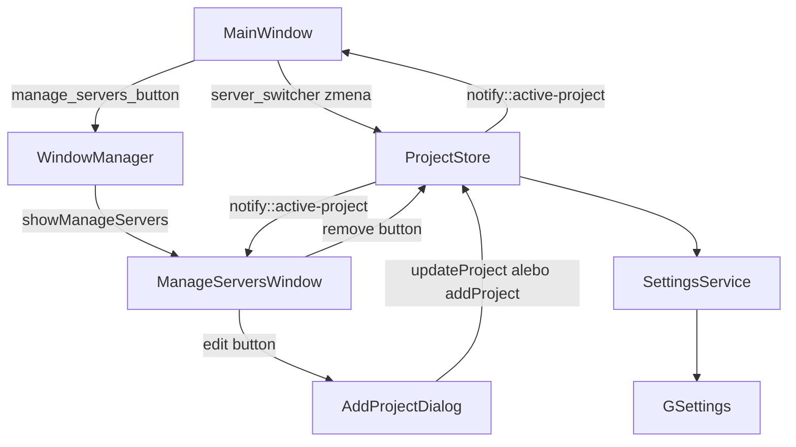

# Requirements

### Overview & Goals

Pridať do hlavného okna (`main.blp` / `MainWindow.ts`) dve nové ovládacie prvky:
1. **Prepínač serverov** — rýchle prepnutie aktívneho projektu/servera (pohľad sa obnoví s dátami vybraného servera).
2. **Tlačidlo správy serverov** — otvorí nové okno so zoznamom serverov a možnosťou pridania/úpravy/vymazania.

Rovnako rozšírime existujúci `AddProjectDialog` o podporu **editácie** existujúceho projektu (bez duplikovania logiky).

### Scope

**In Scope:**
- Pridanie `Gtk.DropDown` do `HeaderBar` v `main.blp` na prepínanie serverov.
- Pridanie tlačidla Spravovať servery do `HeaderBar` v `main.blp`.
- Nové okno `ManageServersWindow` (`.blp` + `.ts`) so zoznamom serverov ako `Adw.PreferencesGroup` s boxed-list.
- Každý riadok zoznamu má tlačidlo Upraviť a Odstrániť.
- Rozšírenie `AddProjectDialog` o editačný mód — pre-vyplnenie polí a update v `SettingsService`.
- Rozšírenie `ProjectStore` o metódy `updateProject()` a `removeProject()`.
- Rozšírenie `SettingsService` o metódy `updateProject()` a `removeProject()`.
- Prepojenie `DropDown` so signálom `notify::active-project` z `ProjectStore`.

**Out of Scope:**
- Skutočné obnovovanie dát z API (dynamický dashboard) — view ostáva statický, mení sa len aktívny projekt v store.
- Migrácia na iný systém perzistencie.

# Technical Design

### Current Implementation

- `main.blp` — Blueprint pre hlavné okno. `HeaderBar` ľavého panelu má tlačidlo refresh a `settings_button`. Žiadny prepínač serverov ani tlačidlo správy.
- `MainWindow.ts` — načítava `main.ui`, napája `settings_button -> wm.showSettings()`.
- `ProjectStore.ts` — GObject s `active-project` property, emituje `notify::active-project`. Má `getProjects()`, `addProject()`, `setActiveProject()`.
- `SettingsService.ts` — perzistuje projekty ako JSON strv v GSettings. Chýbajú `updateProject()` a `removeProject()`.
- `AddProjectDialog.ts` — `Adw.Window` s trojfázovým flow (verify -> add). Vytvorí nový projekt.
- `WindowManager.ts` — centrálny navigačný bod, má `showSettings()`, `showMain()`, `showWelcome()`.

### Key Decisions

 Rozhodnutie | Zvolený prístup | Dôvod |
---|---|---|
 Prepínač serverov | `Gtk.DropDown` s `Gtk.StringList` v `HeaderBar` | Natívny GNOME widget, integruje sa s GObject modelom, odporúčaný v HIG |
 Správa serverov | Samostatné `Adw.PreferencesWindow` + nová `.blp` | Rovnaký vzor ako existujúci `SettingsWindow`, netreba vymýšlať nový vzor |
 Editácia projektu | Rozšírenie `AddProjectDialog` o voliteľný `existingProject?: Project` | Jedna trieda, jedna logika, DRY |
 Prepojenie dropdown a store | `store.connect('notify::active-project', ...)` obojsmerne | Štandardný GNOME signál pattern |

### Proposed Changes

**`SettingsService.ts`** — pridať:
```typescript
public updateProject(project: Project): void  // nahradí podľa id
public removeProject(id: string): void         // odfiltruje podľa id
```

**`ProjectStore.ts`** — pridať:
```typescript
updateProject(project: Project): void   // deleguje na SettingsService
removeProject(id: string): void          // deleguje, ak aktívny -> resetuje active-project
```

**`AddProjectDialog.ts`** — voliteľný parameter `existingProject?: Project`:
- Pre-vyplniť polia, preskočiť verify krok, stav zacína na `add`.
- Pri uložení: `existingProject` -> `store.updateProject()`, inak `store.addProject()`.
- Title okna sa dynamicky nastaví na `_("Upraviť projekt")`.

**`src/ui/manage_servers.blp`** (nový):
```
Adw.PreferencesWindow manage_servers_window {
  Adw.PreferencesPage {
    Adw.PreferencesGroup servers_group {
      [header-suffix]
      Gtk.Button add_server_button { icon-name: "list-add-symbolic"; }
    }
  }
}
```
Riadky serverov sa pridávajú dynamicky z TS ako `Adw.ActionRow` so suffix tlačidlami.

**`src/ui/windows/ManageServersWindow.ts`** (nový) — načíta `manage_servers.ui`, dynamicky plní zoznam, spravuje CRUD operácie.

**`src/ui/main.blp`** — do `HeaderBar` ľavého panelu pribudnú:
```
[end]
Gtk.Button manage_servers_button { icon-name: "network-server-symbolic"; }
[title]
Gtk.DropDown server_switcher {}
```

**`MainWindow.ts`** — prijme `store`, `apiClient`, `logger`; napojí `server_switcher` a `manage_servers_button`.

**`WindowManager.ts`** — pridať `showManageServers(parent: Gtk.Window): void`, aktualizovať `showMain()` s novými deps.

### Architecture Diagram



### File Structure

 Súbor | Zmena |
---|---|
 `src/ui/main.blp` | Pridať `server_switcher` a `manage_servers_button` do HeaderBar |
 `src/ui/windows/MainWindow.ts` | Napojenie nových widgetov, deps rozšírené o store/logger |
 `src/ui/manage_servers.blp` | Nový Blueprint pre okno správy serverov |
 `src/ui/windows/ManageServersWindow.ts` | Nový — dynamický zoznam, CRUD dialógy |
 `src/ui/dialogs/AddProjectDialog.ts` | Rozšírenie o editačný mód (existingProject?) |
 `src/stores/ProjectStore.ts` | Pridanie `updateProject()`, `removeProject()` |
 `src/services/SettingsService.ts` | Pridanie `updateProject()`, `removeProject()` |
 `src/WindowManager.ts` | Pridanie `showManageServers()`, aktualizácia `showMain()` |

# Testing

### Validation Approach

Logika `SettingsService` a `ProjectStore` je testovateľná izolovane cez Vitest. UI flow sa overí manuálnym spustením (`npm run start`).

### Key Scenarios

 Scenár | Očakávaný výsledok |
---|---|
 Prepnutie servera cez DropDown | `store.active_project` sa zmení, `notify::active-project` sa emituje |
 Otvorenie ManageServersWindow | Zoznam zobrazí všetky projekty zo store |
 Klik na Upraviť | `AddProjectDialog` sa otvorí s pre-vyplnenými poliami |
 Uloženie upraveného projektu | `store.updateProject()` sa zavolá, zoznam sa obnoví |
 Klik na Odstrániť | Projekt sa odstráni, zoznam sa obnoví |
 Pridanie nového servera | Nový server sa objaví v zozname aj DropDown |

### Edge Cases

- Vymazanie aktívneho projektu — `store.removeProject()` resetuje `active-project` na prvý dostupný alebo prázdny string.
- Prázdny zoznam serverov — ManageServersWindow zobrazí prázdny stav (`Adw.PreferencesGroup` bez riadkov).
- Dvojité kliknutie na Odstrániť — operácia musí byť bezpečná.

### Test Changes

- `tests/SettingsService.test.ts` — testy pre `updateProject()` a `removeProject()`.
- `tests/ProjectStore.test.ts` — testy pre nové metódy store.

# Delivery Steps

### ✓ Step 1: Rozšíriť SettingsService a ProjectStore o update/remove operácie
SettingsService a ProjectStore majú plnú CRUD podporu pre projekty vrátane unit testov.

- Pridať `updateProject(project: Project): void` do `src/services/SettingsService.ts` — nájde projekt podľa `id` a nahradí ho v GSettings strv.
- Pridať `removeProject(id: string): void` do `src/services/SettingsService.ts` — odfiltruje projekt zo strv.
- Pridať `updateProject()` a `removeProject()` do `src/stores/ProjectStore.ts` — delegujú na SettingsService; `removeProject()` resetuje `active-project` ak ide o aktívny projekt.
- Pridať unit testy pre nové metódy do `tests/SettingsService.test.ts` a `tests/ProjectStore.test.ts`.

### ✓ Step 2: Rozšíriť AddProjectDialog o editačný mód
AddProjectDialog funguje ako jednotný dialóg pre pridanie aj úpravu projektu.

- Pridať voliteľný parameter `existingProject?: Project` do konštruktora `src/ui/dialogs/AddProjectDialog.ts`.
- Ak `existingProject` je definovaný: pre-vyplniť `nameInput`, `urlInput`, `tokenInput`; nastaviť title okna na `_("Upraviť projekt")`; inicializovať stav na `add` (preskočiť verify krok).
- Pri uložení (stav `add`) rozvetvenie: ak `existingProject` -> `store.updateProject()`, inak `store.addProject()`.
- Flow overenia (verify -> save) ostáva nezmenený pre nový projekt.

### ✓ Step 3: Vytvoriť ManageServersWindow (Blueprint + TypeScript)
Nové okno správy serverov zobrazuje zoznam projektov s možnosťou pridania, úpravy a vymazania.

- Vytvoriť `src/ui/manage_servers.blp` ako `Adw.PreferencesWindow` s `Adw.PreferencesGroup` (id: `servers_group`) a tlačidlom pridania v `[header-suffix]`.
- Vytvoriť `src/ui/windows/ManageServersWindow.ts` — prijíma `uiDir`, `store`, `apiClient`, `logger`, načítava `manage_servers.ui`.
- Dynamicky naplniť `servers_group` `Adw.ActionRow` riadkami zo `store.getProjects()` — každý riadok má suffix tlačidlá Upraviť (`edit-symbolic`) a Odstrániť (`user-trash-symbolic`).
- Klik Upraviť otvorí `AddProjectDialog` s `existingProject` a po úspechu obnoví zoznam.
- Klik Odstrániť zavolá `store.removeProject(id)` a obnoví zoznam.
- Tlačidlo pridania otvorí `AddProjectDialog` bez `existingProject`.
- Pridať `showManageServers(parent: Gtk.Window): void` do `src/WindowManager.ts`.

### ✓ Step 4: Pridať server switcher a tlačidlo správy do main.blp a MainWindow.ts
Hlavné okno má funkčný prepínač serverov (DropDown) a tlačidlo na správu serverov v HeaderBari.

- Upraviť `src/ui/main.blp`: do `HeaderBar` ľavého panelu pridať `Gtk.DropDown server_switcher` (v `[title]` pozícii) a `Gtk.Button manage_servers_button` (icon: `network-server-symbolic`) v `[end]`.
- Upraviť `src/ui/windows/MainWindow.ts`: konštruktor prijme `store: ProjectStore`, `apiClient`, `logger` navyše k existujúcim parametrom.
- Vytvoriť `Gtk.StringList` z `store.getProjects().map(p => p.name)`, nastaviť ako model pre `server_switcher`.
- Syncronizovať počiatočný výber DropDown s aktívnym projektom zo store.
- Pripojiť `notify::selected-item` na `server_switcher` -> `store.setActiveProject(selectedId)`.
- Pripojiť `store.connect('notify::active-project', ...)` -> aktualizovať výber DropDown a obnoviť `Gtk.StringList` po zmene zoznamu.
- Pripojiť `manage_servers_button` -> `wm.showManageServers(this.window)`.
- Aktualizovať `WindowManager.showMain()` aby odovzdal `store`, `apiClient`, `logger` do `MainWindow`.