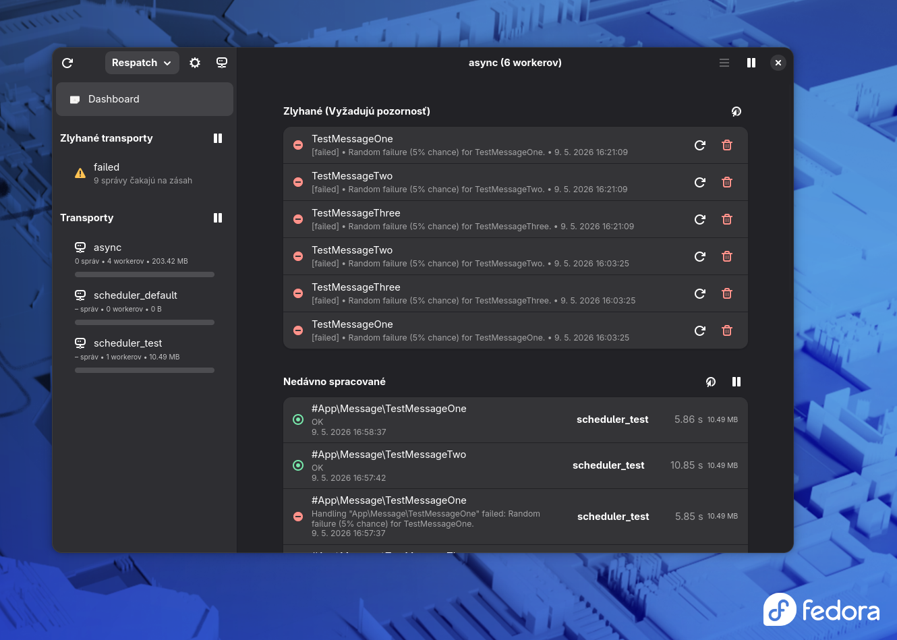

# Respatch 🚀

### Modern monitoring for your Symfony Messenger right on your desktop.

[](data/screenshot.png)

**Respatch** is a native Linux application designed for developers and administrators who need a complete overview of what's happening in their Symfony Messenger. No more constantly refreshing web interfaces – Respatch brings you important information in real time, directly in your desktop environment.

---

## ✨ Key Features

- 📊 **Complete transport overview:** Monitor the status of all your transports in one place.
- 🕒 **Message history:** Instant access to a list of recently processed messages.
- ⚠️ **Failure management:** A clear list of failed messages with the option to immediately retry or delete them.
- 🔔 **System notifications:** Receive desktop notifications when messages fail, so you never miss a critical issue.
- 🖥️ **System integration:** Uses modern GNOME libraries (GTK4 + Libadwaita) for a clean, native look and smooth performance.
- 🌐 **Multi-server support:** Easily switch between different projects and environments.

## 🛠️ How does it work?

Respatch is built on a modern technology stack:
- **GJS (GNOME JavaScript):** Engine using SpiderMonkey for native JavaScript execution in GNOME.
- **GTK4 & Libadwaita:** The latest technologies for building user interfaces following the Human Interface Guidelines.
- **TypeScript:** For robust and type-safe code.
- **Blueprint:** A declarative language for clean UI design.

## 🔮 The future is native

Although Respatch is currently focused on Linux distributions using GNOME, a **native Windows version** is planned for the near future, to bring the same monitoring comfort to all developers regardless of their operating system.

---

## 🚀 Installation & Setup

### 1. Server-side (Prerequisite)
For the application to work correctly, you need to have **[respatch-bundle](https://github.com/respatch/respatch-bundle)** installed and configured on your Symfony server. This bundle provides the necessary API interface and is built on top of the popular `zenstruck/messenger-monitor-bundle`.

### 2. Desktop Application

#### System Requirements (Linux)
- GJS
- GTK4 and Libadwaita
- Node.js (for the build process)

#### Installation Steps

1. **Clone the repository:**
   ```bash
   git clone https://github.com/respatch/respatch.git
   cd respatch/app
   ```

2. **Install dependencies:**
   ```bash
   npm install
   ```

3. **Build the application:**
   ```bash
   npm run build
   ```

4. **Run:**
   ```bash
   npm run start
   ```

---

## 🤝 Contributing

Have an idea for improvement or found a bug? We'd love it if you opened an Issue or sent a Pull Request!

---

*Developed with love for the PHP community.* ❤️
